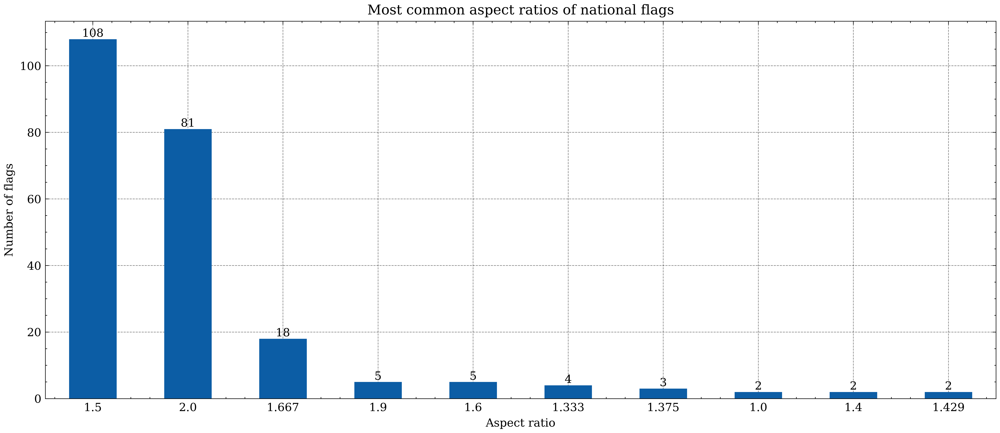

# Description

I like flags so I picked the Wikipedia page for flag ratios. If you know what flag ratios are here is a ChatGPT response that I slightly edited,

    Flag ratios, often referred to as aspect ratios of flags, describe the proportional dimensions of a flag's length and width. This ratio is fundamental in flag design and ensures consistency in flag appearance.

    A flag's aspect ratio is typically expressed as a simple ratio, such as 2:3 or 1:2. In this notation, the first number represents the flag's height (hoist), and the second number represents its length (fly). This ratio determines the flag's overall shape, whether it's longer than it is tall (rectangular), square, or another shape.

# Examples

## Flag of Egypt 🇪🇬

Egypt has a flag ratio of 2:3 (1.5). This is the most common flag ratio :).

Notably Egypt has a flag ratio of 2:3 (1.5). This is the most common flag ratio :). Some other interesting examples are the 

## Flag of Switzerland 🇨🇭

Switzerland has a flag ratio of 1:1 (1).

## Flag of Nepal 🇳🇵

The Nepalese flag isn't even a rectangle and has the ratio

$$
 1:{\frac {6136891429688-306253616715{\sqrt {2}}-{\sqrt {118-48{\sqrt {2}}}}\left(934861968+20332617192{\sqrt {2}}\right)}{4506606337686}}.
$$

# Process
I use the `requests` package to get the HTML of the Wikipedia page with the flag ratios. I then use `BeautifulSoup` to parse the HTML and get the table of flag ratios. I then use `pandas` to read the table into a dataframe. It is important to mention that we could have used `pandas` to read the HTML directly using the `read_html` function but the asignment was to use `BeautifulSoup` or `Scrapy`.

Below you can see an image of the page we are scraping.

# Running the code
To run the code you need the packages in the `requirements.txt` file. You can install them with `pip install -r requirements.txt`. You can then run the code with `python main.py`.

# Result

This is a chart showing the most common flag ratios.

# Final thoughts
It is important to mention that scraping Wikipedia is not a good idea. They don't allow it in their `robots.txt`. Wikipedia also has an API that you can use to get the data you need. Again I did this because the assignment was to use `BeautifulSoup` or `Scrapy`.